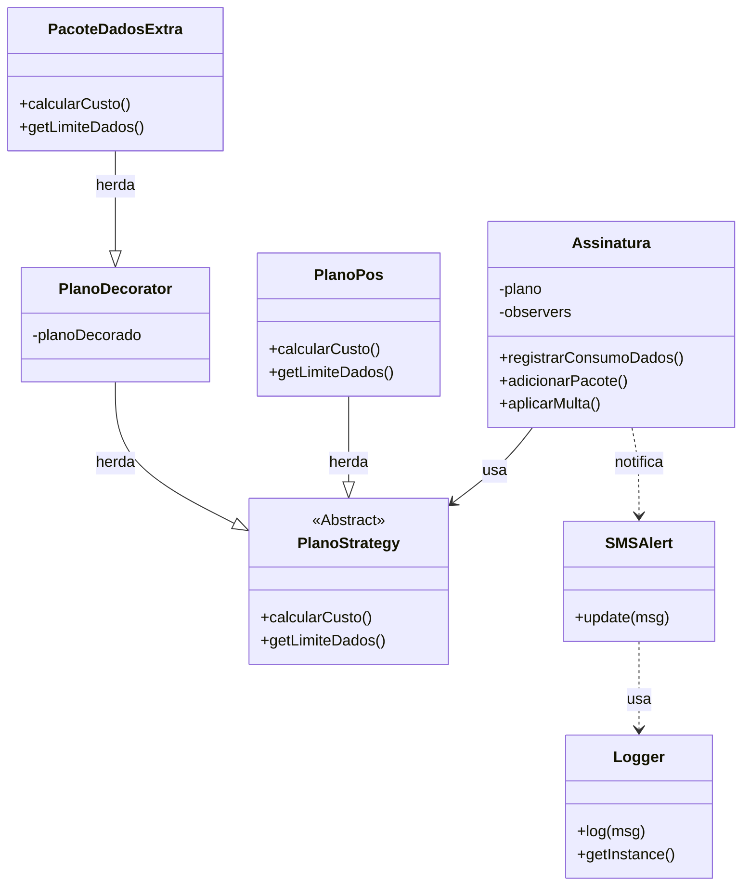

# Trabalho 04 - Design Patterns: Sistema de Telefonia

Este projeto é a entrega final da disciplina de Linguagens de Programação e Paradigmas. O objetivo foi desenvolver um sistema simulado de telefonia para aplicar na prática quatro Padrões de Projeto (Design Patterns), resolvendo problemas reais de estruturação de código.

## O Problema

Gerenciar planos de celular via código pode virar uma bagunça de `if/else` rapidamente. O desafio era criar um sistema que suportasse:
1.  Vários tipos de planos (Pré, Pós, etc) com cálculos diferentes.
2.  Adesão de pacotes extras (Internet, Streaming) sem ter que criar classes infinitas (ex: `PlanoPosComInternet`, `PlanoPosComInternetEStreaming`).
3.  Avisar o usuário automaticamente quando a internet estiver acabando.

## Padrões Escolhidos e Justificativa

Para resolver esses problemas, utilizei os seguintes padrões:

### 1. Strategy (Para os Planos)
* **Onde está:** `src/strategies/`
* **Por que usei:** Em vez de fazer um `if (tipo == 'POS')` gigante na classe principal, criei uma estratégia para cada plano. Assim, a classe `Assinatura` não precisa saber *como* a conta é calculada, ela apenas pede para o plano calcular. Facilita muito se precisarmos criar um plano novo no futuro.

### 2. Decorator (Para Pacotes Extras)
* **Onde está:** `src/decorators/`
* **Por que usei:** É a melhor forma de adicionar funcionalidades em tempo de execução. O pacote de dados "embrulha" o plano original. Quando o sistema pede o preço ou o limite, o Decorator pega o valor do plano original e soma o do pacote. Isso permite adicionar e **remover** pacotes dinamicamente.

### 3. Observer (Para Alertas)
* **Onde está:** `src/observers/`
* **Por que usei:** A assinatura precisa avisar quando o consumo chega em 80% ou 100%. O Observer desacopla isso: a assinatura apenas grita "mudou o consumo!", e quem estiver escutando (o `SMSAlert`) manda a mensagem.

### 4. Singleton (Para Logs)
* **Onde está:** `src/infra/`
* **Por que usei:** Para garantir que só exista um gerenciador de logs rodando no sistema inteiro, centralizando as mensagens no terminal.

## Diagrama da Solução



## Como Rodar o Projeto

Este projeto foi feito em **Node.js**. Verifique se você tem o mesmo instalado.

### 1. Menu Interativo (Simulação)
Para testar o sistema manualmente via terminal:

```bash
node src/app/Main.js
```

Você verá um menu onde pode:
* Consultar a fatura parcial.
* Simular consumo de dados (para ver os alertas do Observer).
* Contratar pacotes (Decorator).
* Cancelar pacotes (para testar a lógica de multa).

### 2. Testes Automatizados
Para rodar os testes que validam os padrões:

```bash
node src/tests/TestesAutomatizados.js
```

Isso vai verificar automaticamente:
* Se o Logger é único (Singleton).
* Se a conta fecha corretamente com e sem pacotes (Strategy/Decorator).
* Se o SMS é enviado no momento certo (Observer).

## Decisões de Implementação

* **Linguagem:** Escolhi **JavaScript (Node.js)** pela facilidade de prototipagem.
* **Interfaces:** Como JS não tem interfaces estritas (como Java), usei classes pai (`PlanoStrategy`) que lançam erro se o método não for implementado, garantindo que o padrão seja seguido corretamente.
* **Regra de Negócio:** Adicionei uma lógica de **multa** no cancelamento do pacote para demonstrar que, ao remover o Decorator, o cálculo volta para a regra do plano base (Strategy), cobrando o excedente do usuário.

---

**Desenvolvido por:** Gabriel Steffens (https://github.com/gabste8831)
